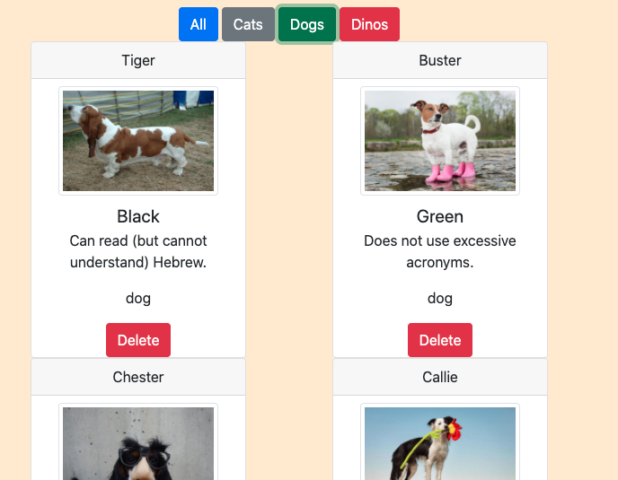

# Adoption Website

## Setup
* Clone this repo to your exercises directory
* Create a setup branch and push up the usual stuff
* Review the [Instructions](instructions.md)

# UPDATE THIS README WHEN THE ASSIGNMENT IS COMPLETED
* Name of Project - Pet Adoptions
* Overview of the project - View all available pets, filter by type (cat, dog, dino)
* Link to your wireframes/prototype - N/A
* Link to the deployed project (will learn in week 5) - N/A
* Link to your project board - https://github.com/GonzalesMatthew/pet-adoption/projects
* Description of the user - pet adoptors
* List of features - View pet images and attributes, filter by type
* Screenshots of your project - 

* List of contributors and links to their GH profiles - 
  * Jesse Robinson - https://github.com/jrobinson0529
  * Lindsey Satterfield - https://github.com/lindseysatterfield
  * Mitchell Crumbley - https://github.com/Mitchell-Crumbley
* Link to Loom video walkthrough of your app (no more than 1 minute long! Make it great) - https://www.loom.com/share/953b9a7d2fcc43e0820448a102c77cd3
